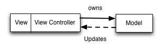

# [Abstract CZ](abstract_cs.tex)

# [Abstract EN](abstract_en.tex)

# Úvod
[TODO]

# Architektura aplikace
Jako doporučenou architekturu aplikací pro platformu iOS (konkrétně iPhone a iPad) uvádí Apple MVC.
Tato architektura rozděluje aplikaci do tří vrstev: Model, View a Controller.

**Model** perzistentní objekty, které aplikace využívá k pro vnitřní logiku a prezentaci dat uživateli.
Každý modelový objekt může být v relaci s libovolným počtem jiných modelových objektů.
Tato vrstva je často reprezentována databází, příkladem mohou být databáze CoreData, Realm nebo SQLite.

**View** datový objekt viditelný uživatelem. View obsahuje logiku pro vykreslení a interakci s uživatelem.
Přestože se view standardně používá pro zobrazení modelových objektů nebo jejich úpravu, jsou od sebe tyto vrstvy striktně odstíněny.
Na platformě iOS tuto vrstvu reprezentuje framework UIKit vytvořený Applem.

**Controller** vrstva, která na základě vstupů z view aktualizuje a mění model nebo překresluje view v případě, že zobrazovaná data už nejsou aktuální.
Jedním z úkolů controlleru je striktně zamezit přímé interakci mezi view a modelem.
Toto oddělení je zavedeno proto, aby view nemuselo znát konkrétní strukturu modelu a aby model nemusel obsahovat logiku pro formátování dat (cena, čas, ...).
Dále se stará o navigaci mezi obrazovkami, síťování a interakci s uživatelem.
Při rozdělení do obrazovek platí pravidlo, že jeden controller obsluhuje jedno nebo více view.
K tomu využívá libovoné množství modelových objektů.
O jednu obrazovku se typicky stará právě jeden controller, ale je možné jich použít více.

Shrneme-li vlastnosti vrstev, jejich klíčové role jsou:
* Model udává, jakým způsobem jsou data uložena,
* View se stará o správné vykreslení dat,
* Controller se stará o ostatní logiku.

Z tohoto shrnutí vyplývá, že controller je velmi blízce spjat s view. Tuto skutečnost zachycuje obrázek 2.

Pro možné porovnání architektury jsem připravil scénář stažení libovolných dat na základě požadavku uživatele. V MVC by se architektura chovala takto:
* Uživatel v aplikaci klikne na tlačítko "Stáhnout data".
* Tuto interakci odchytí view a upozorní controller.
* Controller na základě upozornění stáhne data a předá je modelu k uložení.
* Model ukládá data a notifikuje controller o změně.
* Controller aktualizuje view.
* Nastane-li během stahování chyba, controller vytváří nové view a chybu prezentuje uživateli.

Pro zmíněné notifikace nabízí Apple řešení pomocí Delegate pattern.
Controller musí naimplementovat specifické rozhraní, čímž se stane delegátem.
Jako delegát se pak může zaregistrovat na notifikace obejktů, jejichž rozhraní implementoval.

MVC je v době psaní této práce nejpoužívanější architekturou a to především díky své jednoduchosti.
Při tvorbě větších aplikací ale nemusí být vhodné.
Controller se při nestandradním grafickém návrhu může stát velmi složitým, což výrazně snižuje jeho čitelnost a testovatelnost.
Z tohoto důvodu se MVC často přezdívá Massive View Controller.
Díky přímému napojení controlleru na *View* se při testování chování controlleru (behavioral testing) musí využít simulátoru mobilního operačního systému a aplikaci v něm automaticky "proklikat".
To zvyšuje časovou náročnost testování, dokonce v některých případech znemožňuje testování úplně (controlleru nezle podvrhnout mock objekty).
Tento problém se snaží řešit architektura MVVM od společnosti Microsoft. [zdroj: appol]

## MVVM
Z důvodu nárustu nároků na mobilní aplikace se v posledních letech rozmáhá architektura MVVM.
Tato architektura vychází ze zmíněného MVC a jejím základním úkolem je zjednodušit controller.
Za tímto účelem se ke stávajícím třem vrstvám přidává View Model, který se stará o přípravu dat z Modelu pro zobrazení a také o perzistenci změn.

**View Model** objekt vlastněný controllerem za pomoci kompozice.
Pro controller připravuje naformátované výstupy a poskytuje mu rozhraní pro vstupy.
Výstupem se rozumí veškerá data, která jsou potřebná pro sestavení View.
To může být např. datum ve specifickém formátu, cena včetně měny nebo informace o tom, kolik řádků bude obsahovat tabulka na obrazovce.
Oproti MVC tedy perzistentní data nejsou viditelná controlleru, ale pouze view modelu.
Ten je nejdříve připraví pro zobrazení.
Vstupem může být libovolná interakce uživatele.
Změna textu v textovém poli, stisknutí tlačítka, ale i fyzický pohyb telefonem (otočení obrazovky).
Na základě vstupů spouští view model svou vnitřní logiku a generuje výstupy.

Zodpovědnost controlleru se zavedením View Modelu dramaticky snižuje.
V ideálním případě je controller zodpovědný pouze za správné sestavení view a napojení zfromátovaných výstupů na něj.
Dále pak za odchycení uživatelských interakcí a jejich propagaci do view modelu.
Toto chování zachycuje obrázek 3.

Vrstvy mají následující klíčové vlastnosti:
* Model definuje jakým způsobem jsou data uložena a při změně notifikuje view model,
* View vykresluje na obrazovku naformátované výstupy a upozorňuje controller při interakci uživatele,
* Controller sestavuje hierarchii view, napojuje zformátované výstupy view modelu na view a z uživatelské interakce vytváří vstupy pro view model,
* View model načítá data modelu, na základě vstupů z controlleru nebo změny modelu generuje výstupy pro controller.

Pro porovnání architektury s MVC lze opět využít scénář pro stažení dat. Pro tento scénář by se architektura MVVM chovala následovně:
* Controller napojuje výstupy view modelu na view a vytváří pravidla pro převod uživatelské interakce na vstupy view modelu.
* Uživatel v aplikaci klikne na tlačítko "Stáhnout data".
* View upozorňuje controller na interakci uživatele, ten automaticky vytváří vstup pro view model.
* View model na základě vstupu stahuje data a předává je modelu.
* Model po uložení notifikuje view model, ten vytváří výstup pro controller, který nechává překreslit view.
* V případě chyby vytvoří view model chybový výstup, ten se pomocí controlleru propaguje do view.

Oproti MVC je na tomto příkladu vidět snížení zodpovědnosti controlleru. Tato zodpovědnost se přesunula do view modelu.
Na první pohled nemusí být tato změna opodstatněná, protože logika aplikace nezmizela, jen se přesunula.
Právě to ale umožnilo (nebo minimálně zjednodušilo) způsob, jakým lze logiku testovat.
View model generuje výstupy na základě vstupů, v testech tedy lze uživatelskou interakci podvrhnout a testovat pouze výstupy (není potřeba vytvářet view ani controller).
Dodatečně lze otestovat i uživatelské rozhraní.
Protože logika aplikace je otestována pomocí view modelu, uživatelské rozhraní už stačí otestovat např. shodou s referenčním obrázkem.

Při pohledu na notifikace je vidět, že přibyl typ, který nebyl v MVC potřeba.
Jedná se o notifikace směrem z view modelu ke controlleru (view model nemá referenci na controller, nemůže ho notifikovat přímo).
Některé výstupy view modelu je tedy potřeba sledovat v čase a na jejich změny reagovat.
Toto lze vyřešit pomocí KVO, které nabízí Apple v základu.
KVO umožňuje zaregistrovat se na notifikace o změně stavu nějakého objektu.
V případě controlleru by se registroval na změny stavu výstupů view modelu.
Kdykoliv by se výstup změnil, controller by dostal notifikaci.
Tento přístup ale není běžný pro použití s jazykem Swift.
Místo KVO se nyní standardně používají reaktivní rozšíření, které popisuji v následujících kapitolách.

Přestože implementovaná aplikace není v ohledu na uživatelské scénáře nijak složitá, obsahuje mnoho obrazovek.
Obrazovky jsou vysoce interaktivní a více se k jejich implementaci hodí reaktivní přístup.
Z tohoto důvodu jsem jako architekturu vybral MVVM s použitím reaktivních rozšíření místo standardního MVC.

[zdroj: objcio]

# Testování
V kapitole o testování se podrobněji zabývám způsoby a postupy naznačenými v kapitolách [Architektura MVVM](#architektura-mvvm) a [Reaktivní programování](#reaktivni-programovani).

Testováním software se rozumí postupy a procesy, pomocí kterých lze měřit, zda testovaný software (či jeho části) splňuje požadované nároky či nikoliv.
Opakovaným aplikováním těchto postupů lze v softwaru nalézt chyby, nedostatky nebo chybějící vlastnosti oproti dodané specifikaci.
Výsledky testování následně vypovídají o kvalitě softwaru a o míře splnění specifikace.
[28. 3. 2017 https://www.tutorialspoint.com/software_testing/]

V této práci jsem využil tří typů testů.
Prvním typem jsou uživatelské testy, zkoumající chování uživatelů při používání aplikace.
Druhým typem jsou testy uživatelského rozhraní, které zjišťují, zda vlivem změn ve vzhledu aplikace nebyla omezena některá z vyžadovaných funkcionalit.
Posledním technika testování, kterou jsem využil jsou testy chování aplikace.
Ty ověřují zda aplikace na sadu vstupů produkuje odpovídající výstupy.
V následujícím shrnutí se těmto technikám věnuji podrobněji.

**Uživatelské testy** Slouží ke zjišťování problémů s návrhem vzhledu aplikace.
Na výsledcích těchto testů lze sledovat, jaké části aplikace jsou uživatelům nesrozumitelné či zda se v aplikaci orientují.
Obsahem testů jsou předpřipravené scénáře pokrývající vybrané funkce aplikace.
[29. 3. 2017 http://www.dobryweb.cz/uzivatelske-testovani]
Tyto testy se provádějí na vzorku vybraných uživatelů z cílové skupiny.
Uživatelé během testů prochází aplikaci a mají za úkol naplnit zadanané scénáře.
Během testů se podrobně sleduje, jakým způsobem uživatelé reagují a jak úspěšní jsou při plnění úkolů.
Vzhledem k vysoké časové (mnohdy také finanční) náročnosti se tyto testy provádějí obvykle pouze jednou a to v začátcích projektu.
[29. 3. 2017 http://www.h1.cz/pouzitelnost]

Ve své práci jsem prováděl testování na malé skupině uživatelů 3D tiskáren.
Na základě pozorování jsem následně změnil...[TODO]

**Testy uživatelského rozhraní** Dávají možnost intereagovat s komponentami uživatelského rozhraní za účelem jejich validace.
Na rozdíl od testů chování přistupují tyto testy k aplikaci jako k celku a zacházejí s ní obdobně jako by s ní zacházel uživatel. Tyto testy tedy nemají přístup k vnitřní implementaci aplikace.
Jelikož nevyžadují během chodu zásah člověk (test *nahrazuje* jeho přítomnost), mohou být pouštěny automaticky.
Standardně se tedy pouští při implementaci každé nové funkce, mnohdy až několikrát denně.
[29. 3. 2017 https://developer.apple.com/library/content/documentation/DeveloperTools/Conceptual/testing_with_xcode/chapters/09-ui_testing.html]

Protože tyto testy z jsou v mém případě pouze nadstavbou nad *testy chování* vysvětlené níže, rozhodl jsem se je implementovat pomocí referenčních obrázků.
Testy tedy pro každý podstatný krok scénáře obsahují referenční obrázek, jak by obrazovka měla v dannou chvíli vypadat.
Pokud se vzhled s referenčním obrázkem shoduje, test projde.
Nevýhodou tohoto přístupu je nutnost přegenerování referenčních obrázků v momentě,
kdy se vzhled obrazovky (úmyslně) změní byť o jediný obrazový bod.
Podstatnou výhodou tohoto přístupu je ale nezávislost na implementaci.
Pokud se implementace změní, s velkou pravděpodobností to výsledky testů neovlivní.

## Zdroje
* appol https://developer.apple.com/library/content/documentation/General/Conceptual/DevPedia-CocoaCore/MVC.html
* objcio https://www.objc.io/issues/13-architecture/mvvm/

## Pojmy
* MVC - model view controller
* Model
* View
* Controller
* framework
* user-stories
* behavioral testing
* mock
* MVVM
* view model
* kompozice
* ui test
* delegate pattern
* KVO - key-value observing
* BDD - behavioral driven development
* TDD - test driven development
